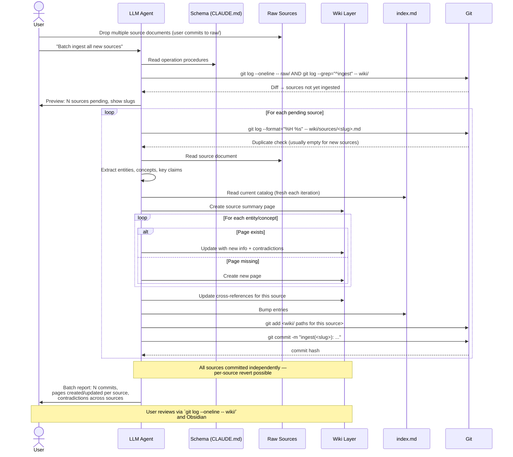

# Sequence Diagram: Batch Ingest Operation

Each source gets its own commit — atomic, revertable per source.

```mermaid
sequenceDiagram
    actor User
    participant LLM as LLM Agent
    participant Schema as Schema (CLAUDE.md)
    participant Raw as Raw Sources
    participant Wiki as Wiki Layer
    participant Index as index.md
    participant Git as Git

    User->>Raw: Drop multiple source documents (user commits to raw/)
    User->>LLM: "Batch ingest all new sources"

    LLM->>Schema: Read operation procedures
    LLM->>Git: git log --oneline -- raw/ AND git log --grep="^ingest" -- wiki/
    Git-->>LLM: Diff → sources not yet ingested

    LLM->>User: Preview: N sources pending, show slugs

    loop For each pending source
        LLM->>Git: git log --format="%H %s" -- wiki/sources/<slug>.md
        Git-->>LLM: Duplicate check (usually empty for new sources)

        LLM->>Raw: Read source document
        LLM->>LLM: Extract entities, concepts, key claims

        LLM->>Index: Read current catalog (fresh each iteration)
        LLM->>Wiki: Create source summary page

        loop For each entity/concept
            alt Page exists
                LLM->>Wiki: Update with new info + contradictions
            else Page missing
                LLM->>Wiki: Create new page
            end
        end

        LLM->>Wiki: Update cross-references for this source
        LLM->>Index: Bump entries

        LLM->>Git: git add <wiki/ paths for this source>
        LLM->>Git: git commit -m "ingest(<slug>): ..."
        Git-->>LLM: commit hash
    end

    Note over LLM,Wiki: All sources committed independently —<br/>per-source revert possible

    LLM->>User: Batch report: N commits,<br/>pages created/updated per source,<br/>contradictions across sources

    Note over User,Wiki: User reviews via `git log --oneline -- wiki/`<br/>and Obsidian
```
