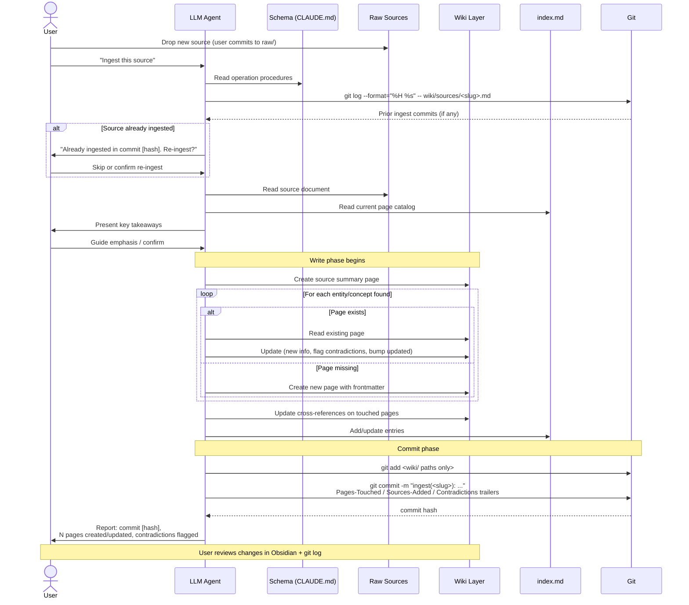

# Sequence Diagram: Ingest Operation

```mermaid
sequenceDiagram
    actor User
    participant LLM as LLM Agent
    participant Schema as Schema (CLAUDE.md)
    participant Raw as Raw Sources
    participant Wiki as Wiki Layer
    participant Index as index.md
    participant Git as Git

    User->>Raw: Drop new source (user commits to raw/)
    User->>LLM: "Ingest this source"

    LLM->>Schema: Read operation procedures

    LLM->>Git: git log --format="%H %s" -- wiki/sources/<slug>.md
    Git-->>LLM: Prior ingest commits (if any)

    alt Source already ingested
        LLM->>User: "Already ingested in commit [hash]. Re-ingest?"
        User->>LLM: Skip or confirm re-ingest
    end

    LLM->>Raw: Read source document
    LLM->>Index: Read current page catalog

    LLM->>User: Present key takeaways
    User->>LLM: Guide emphasis / confirm

    Note over LLM,Wiki: Write phase begins

    LLM->>Wiki: Create source summary page

    loop For each entity/concept found
        alt Page exists
            LLM->>Wiki: Read existing page
            LLM->>Wiki: Update (new info, flag contradictions, bump updated)
        else Page missing
            LLM->>Wiki: Create new page with frontmatter
        end
    end

    LLM->>Wiki: Update cross-references on touched pages
    LLM->>Index: Add/update entries

    Note over LLM,Git: Commit phase

    LLM->>Git: git add <wiki/ paths only>
    LLM->>Git: git commit -m "ingest(<slug>): ..."<br/>Pages-Touched / Sources-Added / Contradictions trailers
    Git-->>LLM: commit hash

    LLM->>User: Report: commit [hash],<br/>N pages created/updated, contradictions flagged

    Note over User,Wiki: User reviews changes in Obsidian + git log
```
