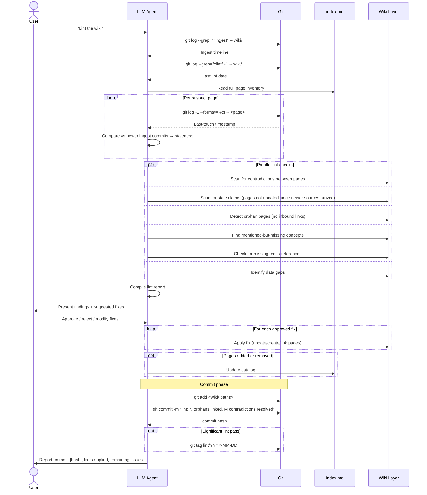

# Sequence Diagram: Lint Operation

```mermaid
sequenceDiagram
    actor User
    participant LLM as LLM Agent
    participant Git as Git
    participant Index as index.md
    participant Wiki as Wiki Layer

    User->>LLM: "Lint the wiki"

    LLM->>Git: git log --grep="^ingest" -- wiki/
    Git-->>LLM: Ingest timeline

    LLM->>Git: git log --grep="^lint" -1 -- wiki/
    Git-->>LLM: Last lint date

    LLM->>Index: Read full page inventory

    loop Per suspect page
        LLM->>Git: git log -1 --format=%cI -- <page>
        Git-->>LLM: Last-touch timestamp
        LLM->>LLM: Compare vs newer ingest commits → staleness
    end

    par Parallel lint checks
        LLM->>Wiki: Scan for contradictions between pages
    and
        LLM->>Wiki: Scan for stale claims (pages not updated since newer sources arrived)
    and
        LLM->>Wiki: Detect orphan pages (no inbound links)
    and
        LLM->>Wiki: Find mentioned-but-missing concepts
    and
        LLM->>Wiki: Check for missing cross-references
    and
        LLM->>Wiki: Identify data gaps
    end

    LLM->>LLM: Compile lint report

    LLM->>User: Present findings + suggested fixes

    User->>LLM: Approve / reject / modify fixes

    loop For each approved fix
        LLM->>Wiki: Apply fix (update/create/link pages)
    end

    opt Pages added or removed
        LLM->>Index: Update catalog
    end

    Note over LLM,Git: Commit phase

    LLM->>Git: git add <wiki/ paths>
    LLM->>Git: git commit -m "lint: N orphans linked, M contradictions resolved"
    Git-->>LLM: commit hash

    opt Significant lint pass
        LLM->>Git: git tag lint/YYYY-MM-DD
    end

    LLM->>User: Report: commit [hash], fixes applied, remaining issues
```
