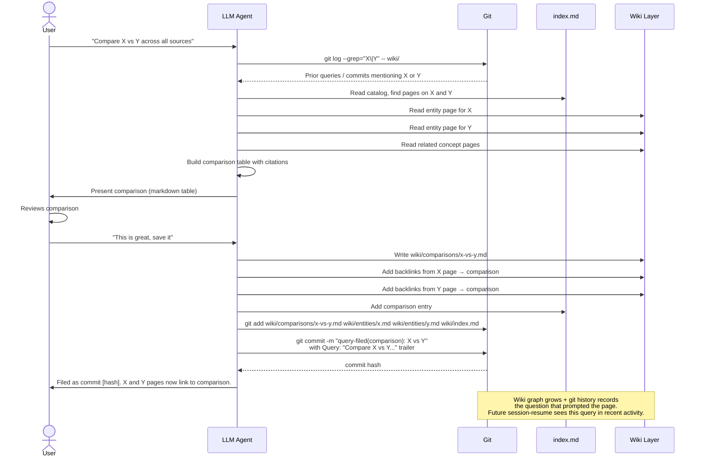

# Sequence Diagram: Query with Auto-Filing

Full lifecycle when a query answer gets filed back into wiki as a new commit — explorations compound in git history.

```mermaid
sequenceDiagram
    actor User
    participant LLM as LLM Agent
    participant Git as Git
    participant Index as index.md
    participant Wiki as Wiki Layer

    User->>LLM: "Compare X vs Y across all sources"

    LLM->>Git: git log --grep="X\|Y" -- wiki/
    Git-->>LLM: Prior queries / commits mentioning X or Y
    LLM->>Index: Read catalog, find pages on X and Y
    LLM->>Wiki: Read entity page for X
    LLM->>Wiki: Read entity page for Y
    LLM->>Wiki: Read related concept pages

    LLM->>LLM: Build comparison table with citations

    LLM->>User: Present comparison (markdown table)
    User->>User: Reviews comparison

    User->>LLM: "This is great, save it"

    LLM->>Wiki: Write wiki/comparisons/x-vs-y.md
    LLM->>Wiki: Add backlinks from X page → comparison
    LLM->>Wiki: Add backlinks from Y page → comparison
    LLM->>Index: Add comparison entry

    LLM->>Git: git add wiki/comparisons/x-vs-y.md wiki/entities/x.md wiki/entities/y.md wiki/index.md
    LLM->>Git: git commit -m "query-filed(comparison): X vs Y"<br/>with Query: "Compare X vs Y..." trailer
    Git-->>LLM: commit hash

    LLM->>User: Filed as commit [hash]. X and Y pages now link to comparison.

    Note over Wiki,Git: Wiki graph grows + git history records<br/>the question that prompted the page.<br/>Future session-resume sees this query in recent activity.
```
