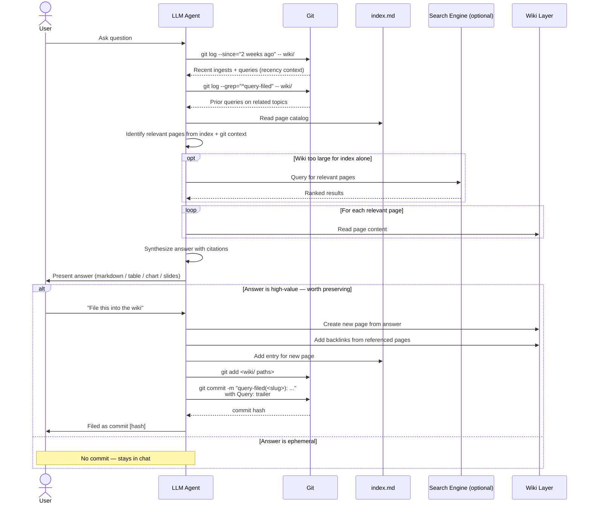

# Sequence Diagram: Query Operation

```mermaid
sequenceDiagram
    actor User
    participant LLM as LLM Agent
    participant Git as Git
    participant Index as index.md
    participant Search as Search Engine (optional)
    participant Wiki as Wiki Layer

    User->>LLM: Ask question

    LLM->>Git: git log --since="2 weeks ago" -- wiki/
    Git-->>LLM: Recent ingests + queries (recency context)

    LLM->>Git: git log --grep="^query-filed" -- wiki/
    Git-->>LLM: Prior queries on related topics

    LLM->>Index: Read page catalog
    LLM->>LLM: Identify relevant pages from index + git context

    opt Wiki too large for index alone
        LLM->>Search: Query for relevant pages
        Search-->>LLM: Ranked results
    end

    loop For each relevant page
        LLM->>Wiki: Read page content
    end

    LLM->>LLM: Synthesize answer with citations

    LLM->>User: Present answer (markdown / table / chart / slides)

    alt Answer is high-value — worth preserving
        User->>LLM: "File this into the wiki"
        LLM->>Wiki: Create new page from answer
        LLM->>Wiki: Add backlinks from referenced pages
        LLM->>Index: Add entry for new page
        LLM->>Git: git add <wiki/ paths>
        LLM->>Git: git commit -m "query-filed(<slug>): ..."<br/>with Query: trailer
        Git-->>LLM: commit hash
        LLM->>User: Filed as commit [hash]
    else Answer is ephemeral
        Note over User,LLM: No commit — stays in chat
    end
```
