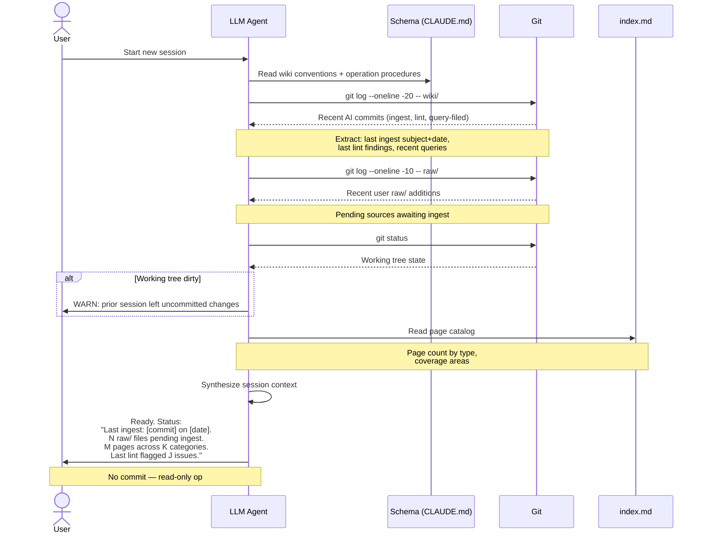

# Sequence Diagram: Session Resume

LLM queries git + reads index at session start to orient itself — bridging the gap between conversations.

```mermaid
sequenceDiagram
    actor User
    participant LLM as LLM Agent
    participant Schema as Schema (CLAUDE.md)
    participant Git as Git
    participant Index as index.md

    User->>LLM: Start new session

    LLM->>Schema: Read wiki conventions + operation procedures

    LLM->>Git: git log --oneline -20 -- wiki/
    Git-->>LLM: Recent AI commits (ingest, lint, query-filed)
    Note over LLM,Git: Extract: last ingest subject+date,<br/>last lint findings, recent queries

    LLM->>Git: git log --oneline -10 -- raw/
    Git-->>LLM: Recent user raw/ additions
    Note over LLM,Git: Pending sources awaiting ingest

    LLM->>Git: git status
    Git-->>LLM: Working tree state
    alt Working tree dirty
        LLM->>User: WARN: prior session left uncommitted changes
    end

    LLM->>Index: Read page catalog
    Note over LLM,Index: Page count by type,<br/>coverage areas

    LLM->>LLM: Synthesize session context

    LLM->>User: Ready. Status:<br/>"Last ingest: [commit] on [date].<br/>N raw/ files pending ingest.<br/>M pages across K categories.<br/>Last lint flagged J issues."

    Note over User,LLM: No commit — read-only op
```
